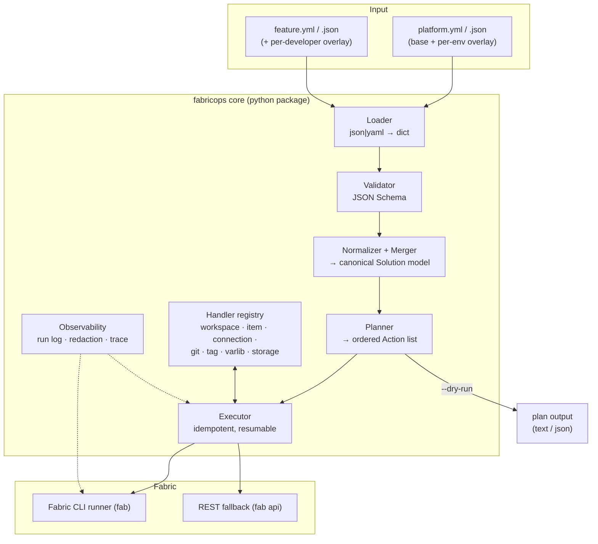

# FabricOps IaC Overhaul — Spec Index

Status: **Draft for review** · Owner: Peer Grønnerup · Created: 2026-08-27

This folder holds the design specs for the second generation of the FabricOps
Infrastructure-as-Code (IaC) layer. It is written to be implemented incrementally,
and to stay in sync with the *Fabric Automation at Scale* blog series
(<https://peerinsights.emono.dk/>).

The backlog derived from these specs lives in [../backlog.md](../backlog.md).
Platform facts and constraints that the specs rely on (with links to Microsoft Learn)
live in [../research/fabric-platform-findings.md](../research/fabric-platform-findings.md).

## Why an overhaul

Today's IaC layer works and demos well, but it is *demo-shaped*, not *product-shaped*:

| Symptom in today's code | Where | Consequence |
| --- | --- | --- |
| Item types hardcoded in flow control (`if item_type in {"Lakehouse","SQLDatabase"}`) | `fabric_setup.py` | Adding an Eventhouse/Warehouse/Environment means editing the engine |
| Provisioning logic and console output interleaved in one 400-line script | `fabric_setup.py` | Cannot unit-test, cannot re-order, cannot dry-run |
| CLI invoked as interpolated strings, output parsed as text | `fabric_cli_functions.run_command` | Quoting hacks (`replace("/", "\\/")`), and errors are returned as *values* (see E04) |
| Recipe files fixed to `infrastructure*.json` / `feature.json` | `fabric_setup.py`, `fabric_release.py`, `fabric_feature_maintainance.py` | One solution per repo; no per-developer feature recipes |
| Only `spark_settings` can carry arbitrary Fabric properties | `fabric_feature_maintainance.py` | Every new property needs new Python |
| No log of what was actually executed | everywhere | Support/debug is "re-run it and watch the console" |

The goal is not to rewrite for its own sake. The goal is that **a new solution shape —
3 environments, 7 layers, arbitrary item types — is a change to a recipe file, not to
Python code.**

## Design principles

1. **Declare, don't script.** The recipe (JSON *or* YAML) is the only place a solution
   is described. The engine turns a recipe into an ordered set of idempotent actions.
2. **Generic first, special-cased explicitly.** Item handling is type-agnostic by
   default. Type-specific behaviour (Lakehouse SQL endpoint provisioning, Report →
   SemanticModel dependency) lives in named, registered *handlers* — never in `if`
   branches in the middle of the flow.
3. **One way to talk to Fabric.** Every Fabric mutation goes through one runner that
   logs, redacts, retries, and raises typed errors. No `subprocess` elsewhere.
4. **Secrets are typed, not pattern-matched.** A value that is secret is wrapped at the
   point it enters the process, so redaction is structural. Regex redaction is a
   second net, not the first.
5. **Plan before apply.** Every command supports `--dry-run` and prints the plan it
   would execute. This is also the fastest possible test harness.
6. **Don't rebuild what the platform (or `fabric-cicd`) already does.** Variable
   libraries, `semantic_model_binding`, deployment pipelines, workspace relations —
   use them; document where they fall short (see E06, E09).
7. **Public-repo-ready.** No tenant-specific IDs, capacities or group GUIDs in
   defaults; everything demo-specific belongs in a solution recipe.

## Decisions (locked 2026-08-27)

These were open questions in the first draft; they are now settled and the specs below
reflect them.

| # | Decision | Effect |
| --- | --- | --- |
| 1 | **Feature storage:** shared per environment, always. Per-**feature** schema isolation is an opt-in solution convention, off by default; shortcut- and clone-based isolation evaluated and out of scope | E07 |
| 2 | **Do not adopt the `fabric-cicd` config file.** Deployment policy lives in the recipe; the parameter file stays committed with a generated `extend:` overlay (toggleable) | E09 |
| 3 | **Recipe layout:** support both, docs lead with `resources/solutions/<name>/`; `infrastructure.json` remains the no-solution fallback | E02, E10 |
| 4 | **Key renames with permanent aliases** - legacy spellings and the items-keyed-by-type shape are supported indefinitely; no planned break | E01, E11 |
| 5 | **`apiVersion` / `kind` optional**, defaulting to `fabricops/v1`; used in docs and the demo | E01 |
| 6 | **Tags use `Key:Value`** with a fixed managed-key list (`ManagedBy`, `Solution`, `Env`, `Layer`, `Lifecycle`, `Owner`, `Branch`, `Retain`) | E05 |
| 7 | **Private to public sync automated**: path allowlist + sanitise gate + one squashed commit per release | E11 |

## Target architecture

## Spec map

| # | Spec | Theme | Blog post it feeds |
| --- | --- | --- | --- |
| [E01](E01-recipe-model-and-formats.md) | Recipe model, JSON **and** YAML, schema, merge semantics | Definition layer | #3, #4 |
| [E02](E02-solution-resolution.md) | Multi-solution + per-developer recipe resolution | Definition layer | #4 |
| [E03](E03-generic-provisioning-engine.md) | Generic provisioning engine, handlers, generic property/definition passthrough | Engine | #4 |
| [E04](E04-cli-runner-and-observability.md) | CLI runner, structured logging, redaction, dry-run | Engine | #4, #5 |
| [E05](E05-tags-extended-properties.md) | Tags as extended/custom properties | Governance & automation | #6 |
| [E06](E06-variable-libraries.md) | Where variable libraries fit (and where they don't) | Configuration | #6 |
| [E07](E07-feature-dev-storage.md) | Storage in feature development — options & recommendation | Ways of working | #7 |
| [E08](E08-feature-lifecycle.md) | Feature workspace lifecycle hardening | Ways of working | #5 |
| [E09](E09-release-and-fabric-cicd.md) | Release path, `fabric-cicd` alignment | Deployment | #8 |
| [E10](E10-repo-blueprint.md) | Repo/folder blueprint, workspace folders, git providers | Repo structure | #3 |
| [E11](E11-quality-and-dx.md) | Tests, CI, docs, private→public sync | Engineering hygiene | #9 |
| [E12](E12-agent-skill.md) | An agent skill that drives FabricOps | Adoption | #4 |
| [E13](E13-demo-solution.md) | The reference (demo) solution | Proof and test fixture | #4 |

## Compatibility promise

The overhaul is delivered behind a compatibility layer:

* Existing `automation/resources/environments/infrastructure*.json` and `feature.json`
  keep working unchanged (they resolve as the `default` solution, see E02).
* Existing pipeline/workflow entry points (`fabric_setup.py`, `fabric_release.py`,
  `fabric_feature_maintainance.py`) keep their current arguments and gain new optional
  ones (`--solution`, `--dry-run`, `--log-level`, `--trace-file`).
* Legacy key spellings, the `merge_type` flag and the items-keyed-by-type shape are
  supported **permanently** (decision 4). There is no planned removal release; alias
  coverage is enforced by tests (E11-S5).
